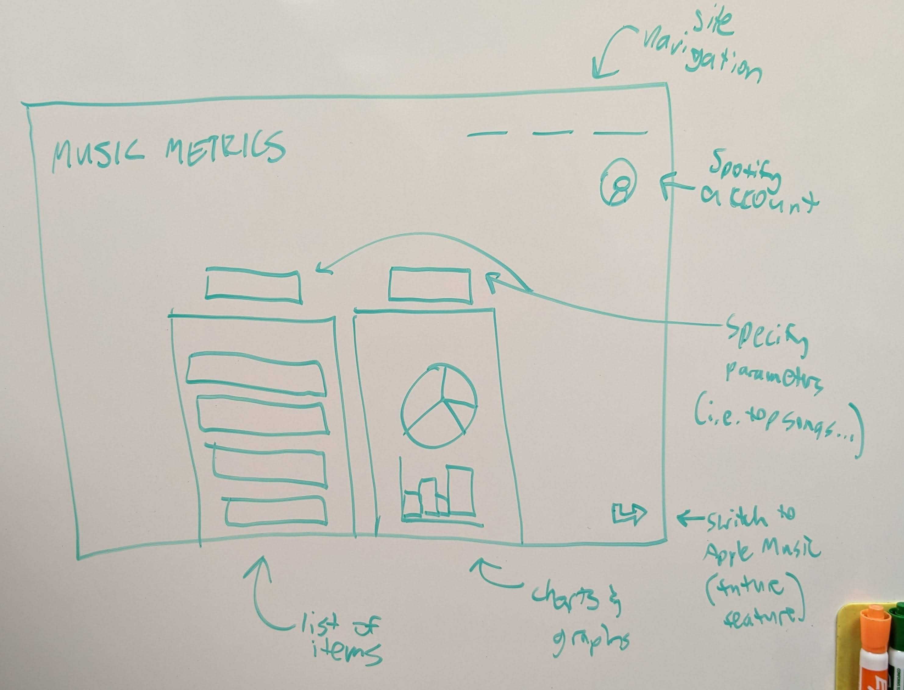

# music-metrics
Web app that tracks and reports in-depth Spotify listening stats.

## Elevator Pitch

You probably have listened to music once or twice. Have you ever wondered what your top songs are, or more specifically, how many times you've listened to them? This web app will not only deliver the facts and figures that you are given by Spotify, but we will expound upon those stats to really satisfy your itch to know about your listening history. For example, we can provide top albums, total listening time for a certain time period, and the counts for every song you've explored (all things that Spotify doesn't report directly).

## Design

## Key Features

* Ability to sign in via Spotify (possibly Apple Music in the future)
* Access to various statistics that Spotify doesn't directly provide
* Viewable charts and graphs based on usage over time
* Ability to generate new playlists based on recommended songs (maybe)

## Useful Information

* Host: Dell Optiplex 9010 running Ubuntu 22.04
* Hostname: Tommy
* Domain: musicmetrics.app

## What I Learned (HTML portion):

Throughout this unit, I have learned a lot more about HTML despite already knowing a decent amount. For example, I have never embedded videos in a webpage that way before. Additionally, I learned more about the various options we have for inputting information and even displaying that information, using elements like tables.

## What I Learned (CSS portion):

For years now, I have been using CSS to design websites that are more pleasing to the eye. I haven't, however, ever received any kind of formal education about any kind of HTML, CSS, or JavaScript. Before this unit, I thought I already knew most of what there was to know about CSS. On the contrary, I ended up learning quite a lot about various areas of CSS. I think the most I learned came from the section about transitions and animations. I was unaware of just how many options you have for that type of thing.

## What I Learned (JavaScript portion):

JavaScript is one of those languages I have always had a love/hate relationship with. Throughout this unit, however, I have learned about many new ways I can use JS to improve my web programming. I've learned that JavaScript is useful because it enables developers to create interactive and dynamic web pages that can respond to user input and update content in real-time. Additionally, JavaScript can be used for both front-end and back-end development, making it a versatile language for building web applications of all kinds.

## What I Learned (Service portion):

I think the most valuable thing I learned through this section of the class has been how simple it is to set up services accessible via HTTP request. After taking CS 240 and 340, it seems like it is so complicated (although that's probably the fault of Java and Android, where you have to write 15 lines of code to accomplish what can be done in much less in other languages). Going deeper into that, the fetch() call in JavaScript is something that I remember being difficult or a pain to work with, but this class has taught me how to more properly use it in a way that makes things so much simpler.

## What I Learned (Database portion):

There are a couple cool things I was able to learn in this section. First of all, I never done anything backend with JavaScript before, I didn't really know that was an option. I love how easy it is to integrate MongoDB with JavaScript via node.js, it's so much easier than writing large DAO classes that access relational (or other) databases like you might have to in other languages like object-oriented ones. It also allows for a lot of ease in persisting data. Now instead of storing the data in memory which will be wiped every time the server shuts off, we can keep a good list of the scores for Simon. I feel like this is just the tip of the iceberg for database use connected to the front end.

## What I Learned (Login portion):

In this unit, despite it not being as lengthy as past units, I still learned a lot. One thing I thought was interesting was the different methods of authorization, like SSO, OAuth, etc. I also was unaware of things like AWS Cognito and Google Firebase, so it is interesting to know that even though I didn't use those for this class, there are third party options available for me to use. I was also interested to learn about password hashing. I attempted to add this functionality to my own project a couple weeks ago and had I read ahead to this unit, a lot of questions could have been answered.

## What I Learned (WebSocket portion):

WebSockets are really cool. As mentioned above, I have at least a little bit of experience with most of the concepts in this class, but the WebSocket protocol was completely new to me. I've never had a project before this that requires me to need that type of connection, but it is insanely useful. It honestly surprises me that it wasn't developed sooner. It is so nice for the client to not have to constantly poll the server for new information, and I'm sure it makes the total runtime in the end a certain amount faster. To add upon that, linking multiple clients to each other in a sort of web-chat feature isn't nearly as complex as you would think, and certainly simpler than it would have been 20 years ago. I definitely plan on using WebSocket quite a lot throughout my life of web/app development.
